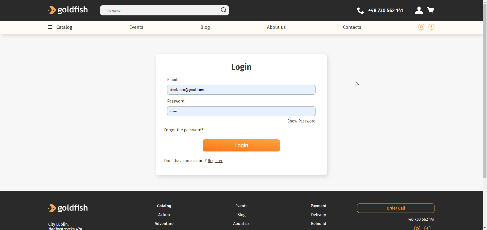

<details>
  <summary>Table of Contents</summary>
  <ol>
   <li>
      <a href="#about-the-project">About The Project</a>
    </li>
    <li><a href="#technologies">Technologies</li>
    <li><a href="#features">Features</a></li>  
    <li><a href="#preview">Preview</a></li>
    <li><a href="#how-to-install">How to install</a></li> 
    <li><a href="#other-commands">Other commands and documentation</a></li>
    <li><a href="#contact">Contact</a></li>
  </ol>
</details>

# About the project

**Gold Fish is a MERN stack application with TypeScript**

The aim of this project is to design and implement an online store that will specialize in the sale of digital games, while also offering elements of a discussion forum for the gaming community. Such a store will allow players to conveniently purchase games and at the same time participate in interactive discussions, reviews, exchange of experiences and sharing observations about individual titles.

The website is designed to allow you to search, buy games, view ratings, add ratings and reviews, create an account, view your order history, write a blog, create events, admins can add products, edit them, edit events, blogs and view statistics on orders on the website

The site will also have an adaptive version for all devices, which will help increase the comfort of use for users and expand the audience

# Technologies

- `React`
- `Redux`
- `TypeScript`
- `CSS Modules`
- `Express`
- `MongoDB`
- `Swagger`
- `JSON Web Token`
- `PayPal API`

# Features

**User Authentication:**

- Users can register and log in securely using JWT (JSON Web Tokens) for authentication.
- Passwords are securely hashed and stored in the database.  
  <a href="#registration-and-login-preview-with-validation">Preview</a>

**Game filtering:**

- Users can search for games using filters such as category, publisher, price range, stars, search only discounted games, and search by keywords.
- Search results are displayed in a user-friendly manner with different sorting options.
- Search parameters are stored at url, so you can sent url with filters to your friend and filters will be automaticly applied.  
  <a href="#filtering-preview">Preview</a>

**Shopping Cart**

- Users can add products to their shopping cart, which is stored in redux and localstorage.
- In cart page you can activate promocode for your order.  
  <a href="#game-odering">Preview</a>

**Order Placement**

- Users can place orders, providing shipping information and payment details and choose delivery and payment method.
- PayPal is integrated for secure and convenient payment processing.  
  <a href="#game-odering">Preview</a>

**Author Panel**

- Authors have access to a dashboard with article statistics and charts.
- Authors can manage theis articles, edit, or delet them.
- Article preview image can be uploaded and stored on Cloudinary for efficient image management.  
  <a href="#author-panel-functional">Preview</a>

**Loyality system**

- When users make an order they receive points, for this points you can get new loyality levels, and receive promocodes or discounts.  
  <a href="#game-odering">Preview 1</a>  
  <a href="#user-page-as-active-user">Preview 2</a>

**Article system**

- Authors can write an article, users can see this articles, like or dislike them, write comments, and reply for other user comments.
- Blog page also have filtration system, which can help you easily find article for you.  
  <a href="#author-panel-functional">Preview</a>

**Validation**

- Each form on the site has appropriate front and back validation and error handling.
- Errors are shown to the user using the react-toastify library.  
  <a href="#registration-and-login-preview-with-validation">Preview</a>

**Adaptive design**

- Website has adaptive design for different devices, up to width 290px.  
  <a href="#adaptive-design-preview">Preview</a>

**Wishlist**

- Users can add games to their whishlist.  
  <a href="#game-odering">Preview</a>

**Navigation**

- Main navigation component on the site is breadcrumbs.

# Preview

_Some gifs may take a long time to load, if you want to see them wait a bit._

## View from unauthorized user


## Registration and login preview with validation



## User page as new user


## User page as active user


## Game odering


## Author panel functional


## Filtering preview


## Adaptive design preview


# How to install

1. Clone the repo
   ```sh
   git clone https://github.com/Freekson/GoldFish.git
   ```
2. Go to backend folder
   ```sh
   cd backend
   ```
3. Install NPM packages
   ```sh
   npm install
   ```
4. Go to frontend folder
   ```sh
   cd ../frontend
   ```
5. Install NPM packages
   ```sh
   npm install
   ```
6. Run backend and frontend command
   ```sh
   npm run dev
   ```

# Other commands

[Backend Commands](https://github.com/Freekson/GoldFish/wiki/Backend-Documentation#backend-commands)  
[Frontend Commands](https://github.com/Freekson/GoldFish/wiki/Frontend-Documentation#frontend-commands)  
[Project documentation](https://github.com/Freekson/GoldFish/wiki)

# Contact

- [Instagram](https://www.instagram.com/freeksons)
- [Telegram](https://t.me/freekson)
- [Linkedin](https://www.linkedin.com/in/yehor-dreval-1634b4207/)
